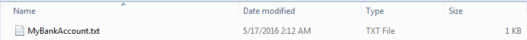
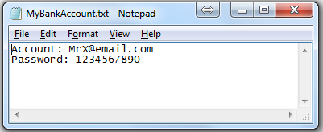
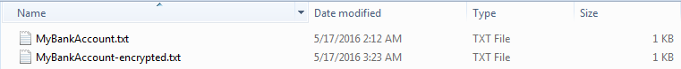
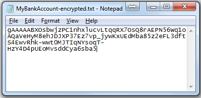
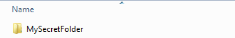
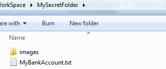

.. _symmetric:

Using symmetric encryption
===============================================================================
The workd **symmetric** means using same secret key in encryption and decryption. So you have to **use a very safe channel to send your key** to who is going to read your encrypted token. That's the only weakness of symmetric algorithm. If you want to avoid that, my recommendation is using symmetric algorithm to encrypt your files, and use :ref:`Asymmetric Encryption <asymmetric>` algorithm to encrypt your key.

Now, let's walk through the easiness of using ``windtalker``.

Set up a password
-------------------------------------------------------------------------------
First, import::

	>>> from windtalker.symmetric import SymmtricCipher

Come up a **difficult to guess but easy to remember** password, this could use any character you want::

	>>> cipher = SymmtricCipher(password="MyPassword")

Notice: **hard code your password in your script is always a bad idea, except you can guarantee its safety**. You could do it either putting it in a **credential file, and make sure it's safe**. For example you have a ``credential.py``::

	password = "MyPassword"

And then you can do::

	>>> import credential
	>>> cipher = SymmtricCipher(password=credential.password)

Also, **windtalker allows user manually enter your password** in encryption and decryption process. It's safer to keep it in your mind :)

::

	>>> cipher = SymmtricCipher()
	Please enter your secret key (case sensitive): MyPassword

Encrypt/Decrypt a message
-------------------------------------------------------------------------------
Here's an example:

.. code-block:: python

	# Encryption
	>>> message = "Turn right at blue tree"
	>>> token = cipher.encrypt_text(message)

	# Decryption, view of your friend
	>>> new_cipher = SymmtricCipher(password="MyPassword")
	>>> original_message = new_cipher.decrypt_text(token)

Encrypt/Decrypt a file
-------------------------------------------------------------------------------
Suppose you have a file ``MyBankAccount.txt`` to send:

.. code-block:: python

	# Encryption, if output_path is not given, windtalker will automatically 
	# generate one with surfix "-encrypted" for you.
	>>> cipher.encrypt_file("MyBankAccount.txt", 
	    output_path="MyBankAccount-encrypted.txt", overwrite=True)

This is what you get will after encryption:

Notice: if ``overwirte`` keyword is ``True``, then it will silently overwrite the output file if it exists. By default, it's ``False``.

For decryption, you need to do:

.. code-block:: python

	# Decryption, view of your friend
	>>> new_cipher = SymmtricCipher(password="MyPassword")
	>>> new_cipher.decrypt_file("MyBankAccount-encrypted.txt", 
	    output_path="MyBankAccount-decrypted.txt", overwirte=True)

Encrypt/Decrypt a directory
-------------------------------------------------------------------------------
For encrypt entire directory, usually you have two choice:

1. Make a zip archive and encrypt this zip file. **but it may becomes very big!**
2. Encrypt every single files.

For example if you have ``MySecretFolder`` to encrypt:

The API is very similar to :meth:`~windtalker.cipher.BaseCipher.encrypt_file`:

.. code-block:: python

	# Encryption
	>>> cipher.encrypt_dir("MySecretFolder", 
	    output_path="MySecretFolder-encrypted", overwirte=True)

	# Decryption
	>>> cipher.decrypt_dir("MySecretFolder-encrypted", 
	    output_path="MySecretFolder-decrypted", overwirte=True)